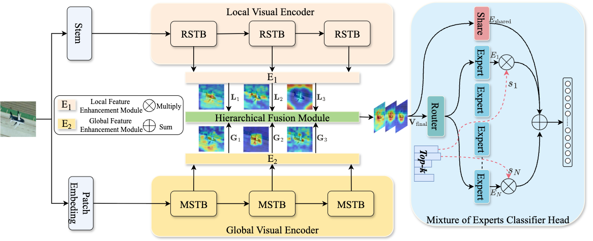

# AFM-Net: Advanced Fusion Model Network for Remote Sensing Scene Classification
<p align="center">
  
</p>

<h1 align="center">AFM-Net: Advanced Fusion Model Network</h1>

---


---

##  🔍 Introduction 

Remote sensing scene classification of high-resolution images remains a challenging task due to the complex spatial structures and multi-scale characteristics of objects.
We propose AFM-Net (Advanced Fusion Model Network), a dual-branch framework that:
* ✅ Combines CNN backbone (local texture & hierarchical priors) with Vision Mamba (global sequence modeling).
* ✅ Employs a multi-scale fusion strategy for cross-branch feature integration.
* ✅ Uses a Mixture-of-Experts (MoE) classifier for adaptive feature aggregation.

Extensive experiments show AFM-Net achieves state-of-the-art performance on AID, NWPU-RESISC45, and UC Merced datasets.

---

##  📐 Model Architecture

<p align="center">
  
</p>

## ⚙️Installation 
### 1.Clone this repository:
```bash
git clone https://github.com/tangyuanhao-qhu/AFM-Net.git
cd AFM-Net
```
### 2.Create a Python virtual environment and install dependencies:
```bash
conda create -n afm-net python=3.8 -y
conda activate afm-net
pip install -r requirements.txt
```
### 3.Prepare datasets
The expected folder structure for AID dataset is as follows:
```
AID/
├── Airport/
│   ├── img1.jpg
│   ├── img2.jpg
│   └── ...
├── Beach/
│   ├── img1.jpg
│   └── ...
├── ...
```
Other datasets (NWPU-RESISC45, UC Merced) should follow a similar class-wise folder organization.

## 🚀Usage 
🔹 Training 
 ```bash
python train.py --dataset AID --batch_size 32 --epochs 500
 ```
## 🔥 Performance Comparison 
| Model                      | Param (M) | UC Merced (F1) | AID (F1) | NWPU (F1) |
| :------------------------- | :-------: | :-------------: | :------: | :-------: |
| **CNN-based Models**       |           |                 |          |           |
| ResNet18                   | 11.2      | 90.22           | 92.22    | 93.75     |
| ResNet50                   | 23.6      | 90.85           | 92.22    | 94.40     |
| ResNet101                  | 42.6      | 93.74           | 91.77    | 94.75     |
| **Transformer-based Models**|          |                 |          |           |
| DeiT-T                     | 5.5       | 84.42           | 80.63    | 83.45     |
| DeiT-S                     | 21.7      | 91.61           | 80.92    | 82.98     |
| DeiT-B                     | 85.8      | 92.34           | 82.05    | 79.98     |
| ViT-B                      | 88.3      | 90.18           | 82.54    | 80.16     |
| ViT-L                      | 303.0     | 92.42           | 81.84    | 79.46     |
| Swin-T                     | 27.5      | 88.88           | 87.35    | 89.72     |
| Swin-S                     | 48.9      | 89.72           | 87.03    | 89.28     |
| Swin-B                     | 86.8      | 91.66           | 86.37    | 89.41     |
| **Mamba-based Models**     |           |                 |          |           |
| ViMamba-T                  | 30.0      | 92.81           | 91.10    | 93.94     |
| VisionMamba-T              | 7.1       | 83.06           | 78.68    | 88.97     |
| VisionMamba-S              | 25.6      | 89.32           | 87.54    | 95.21     |
| VisionMamba-B              | 96.9      | 88.82           | 90.72    | 95.06     |
| RSMamba-B                  | 6.4       | 93.88           | 91.66    | 94.84     |
| RSMamba-L                  | 16.2      | 94.74           | 91.90    | 95.02     |
| RSMamba-H                  | 33.1      | 95.25           | 92.63    | 95.18     |
| HC-Mamba-T                 | 6.6       | 94.76           | 91.42    | 94.87     |
| HC-Mamba-S                 | 15.7      | 95.08           | 91.95    | 95.08     |
| HC-Mamba-B                 | 32.8      | 95.34           | 92.86    | 95.25     |
| **Ours (AFM-Net)**         | **45.5**  | **96.81**       | **93.71**| **95.52** |

##  🎯Model Visualizations (CAM)
These figures visualize where AFM-Net focuses on each scene using Class Activation Maps (CAM).

## 📖 Citation 
If you use AFM-Net in your research, please cite our paper:
```bibtex
@article{tang2025afmnet,
  title={AFM-Net: Advanced Fusion Model Network for Remote Sensing Scene Classification},
  author={Tang, Yuanhao and Hu, Zhengpei and Xing, Junliang and Zhang, Chengkun and Huang, Jianqiang},
  journal={arXiv preprint arXiv:XXXX.XXXXX},
  year={2025}
}
```
## 👨‍💻 Authors 
* Yuanhao Tang, Zhengpei Hu (Graduate Student Member, IEEE)
* Junliang Xing (Senior Member, IEEE)
* Chengkun Zhang, Jianqiang Huang (Member, IEEE)


