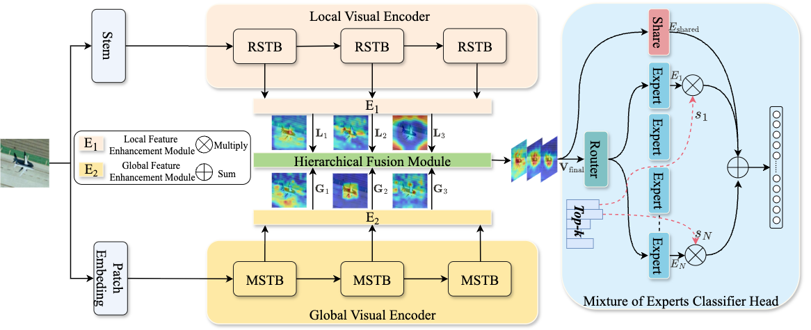

# Hierarchical Fusion of Local and Global Visual Features with Mixture-of-Experts for Remote Sensing Image Scene Classification
<p align="center">
  
</p>


<p align="center">

  
  
  
  <!-- <a href="https://doi.org/10.48550/arXiv.2510.27155">
    
  </a> -->
  <a href="https://huggingface.co/Jamtang/classification">
    
  </a>

</p>

##  🔍 Introduction 

Remote sensing scene classification of high-resolution images remains challenging due to complex spatial structures, semantic ambiguity, and large intra-class diversity. We propose a hierarchical fusion framework that:

- ✅ **Parallel Heterogeneous Encoder**: Couples a CNN-based Local Visual Encoder with a lightweight Mamba-based Global Visual Encoder to achieve complementary local-global representation learning.
- ✅ **Hierarchical Fusion Strategy**: Employs a Hierarchical Fusion Module to progressively align and aggregate heterogeneous features across multiple semantic stages.
- ✅ **Adaptive MoE Classifier**: Introduces a Mixture-of-Experts (MoE) head for adaptive decision-level information allocation, improving robustness on hard and semantically confusing categories.

Extensive experiments demonstrate that the proposed framework achieves state-of-the-art performance on the AID, NWPU-RESISC45, and UC Merced datasets while maintaining a favorable accuracy-efficiency trade-off.

---

##  📐 Model Architecture

<p align="center">
  <!-- 点击图片会跳转/下载 fig1.pdf -->
  <a href="docs/fig1.pdf">
    
  </a>
</p>

## ⚙️Installation 
### 1.Clone this repository:
```bash
git clone https://github.com/tangyuanhao-qhu/classification.git
cd classification
```
### 2.Create a Python virtual environment and install dependencies:
```bash
conda create -n class python=3.8 -y
conda activate class
pip install -r requirements.txt
```
### 3. Prepare datasets

The datasets should be organized in a class-wise folder structure. For example, the expected folder structure for the AID dataset is:

```text
AID/
├── Airport/
│   ├── img1.jpg
│   ├── img2.jpg
│   └── ...
├── Beach/
│   ├── img1.jpg
│   └── ...
├── ...
```
Other datasets, such as NWPU-RESISC45 and UC Merced, should follow the same class-wise organization:
```
NWPU-RESISC45/
├── airplane/
├── airport/
├── ...

UCM/
├── agricultural/
├── airplane/
├── ...
```
We also provide the exact split files used in our experiments. The released split files store relative image paths in the following format:
```
class_name/image_name.jpg
For example:
{
  "image_paths": [
    "StorageTanks/storagetanks_254.jpg",
    "Industrial/industrial_370.jpg",
    "BareLand/bareland_53.jpg"
  ]
}
```
When loading a split file, please set the dataset root to the corresponding dataset directory (e.g., AID/, NWPU-RESISC45/, or UCM/).
## 🚀Usage 
🔹 Training 
 ```bash
python train.py --dataset AID --batch_size 32 --epochs 500
 ```
## 🔥 Performance Comparison 
| Model                      | UC Merced (F1) | AID (F1) | NWPU (F1) |
| :-------------------------- | :-------------: | :------: | :-------: |
| **CNN-based Models**        |                 |          |           |
| ResNet18                    | 90.22           | 92.22    | 93.75     |
| ResNet50                    | 90.85           | 92.22    | 94.40     |
| ResNet101                   | 93.74           | 91.77    | 94.75     |
| **Transformer-based Models**|                 |          |           |
| DeiT-T                      | 84.42           | 80.63    | 83.45     |
| DeiT-S                      | 91.61           | 80.92    | 82.98     |
| DeiT-B                      | 92.34           | 82.05    | 79.98     |
| ViT-B                       | 90.18           | 82.54    | 80.16     |
| ViT-L                       | 92.42           | 81.84    | 79.46     |
| Swin-T                      | 88.88           | 87.35    | 89.72     |
| Swin-S                      | 89.72           | 87.03    | 89.28     |
| Swin-B                      | 91.66           | 86.37    | 89.41     |
| CMTFNet                     | 94.64           | 93.01    | 94.31     |
| **Mamba-based Models**      |                 |          |           |
| ViMamba-T                   | 92.81           | 91.10    | 93.94     |
| VisionMamba-T               | 83.06           | 78.68    | 88.97     |
| VisionMamba-S               | 89.32           | 87.54    | 95.21     |
| VisionMamba-B               | 88.82           | 90.72    | 95.06     |
| RSMamba-B                   | 93.88           | 91.66    | 94.84     |
| RSMamba-L                   | 94.74           | 91.90    | 95.02     |
| RSMamba-H                   | 95.25           | 92.63    | 95.18     |
| HC-Mamba-T                  | 94.76           | 91.42    | 94.87     |
| HC-Mamba-S                  | 95.08           | 91.95    | 95.08     |
| HC-Mamba-B                  | 95.34           | 92.86    | 95.25     |
| **Ours**                    | **96.81**       | **93.71**| **95.52** |


